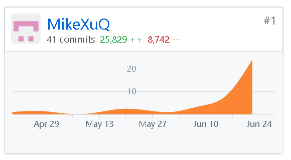

# Final Report
## 课程学习自我总结
第一次这么正式的参与项目的开发，第一次觉得项目不是能跑就行，规范以及项目结构是很重要的，尤其是对于大型项目，不然根本无法实现人员以及工作分配的协调。参加这么一次开发，感觉很有意义，谢谢老师提供的机会。同时非常感谢在前端开发中Els-y和James-Yip提供的帮助以及建议。	
## PSP2.1统计表
| PSP2.1 | Time|
| ----- | :----- |
| Planning | 7 |
| 1. Estimate| 7 |
| Development | 85 |
| 1. Analysis | 8 |
| 2. Design Spec | 4 |
| 3. Design Review | 4 |
| 4. Coding Standard | 2 |
| 5. Design | 10 |
| 6. Coding | 35 |
| 7. Code Review | 7 |
| 8. Test | 15 |
| Reporting | 8 |
| 1. Test Report | 1 |
| 2. Size Measurement | 2 |
| 3. Postmortem & Process Improvement Plan | 5 |
## GIT统计报告

## 最有价值的工作
重构项目框架，方便拓展
