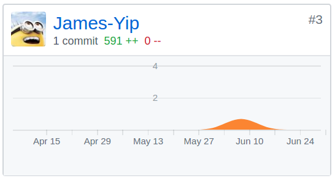
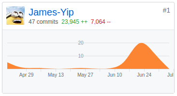

# Final Report

## 个人总结

在本次大作业中，我主要负责客户端的UI设计与具体实现。
整个项目做下来后, 感触最深的是 `规范的统一` 以及 `人员的恰当分工与协调`。 这在具体实现时十分重要, 否则就无法实现多人高效协同开发。

最后, 感谢所有队友的辛勤努力!

## PSP 2.1 统计

| PSP2.1            | Personal Software Process Stages | Time（%） |
| ----------------- | -------------------------------- | --------- |
| **Planing**       | **计划**                         | **5**     |
| - Estimate        | 估计开发时间                     | 5         |
| **Development**   | **开发**                         | **91**    |
| - Analysis        | 需求分析                         | 10        |
| - Design Spec     | 生成设计文档                     | 5         |
| - Design Review   | 设计复审                         | 4         |
| - Coding Standard | 代码规范                         | 2         |
| - Design          | 具体设计                         | 10        |
| - Coding          | 具体编码                         | 30        |
| - Code Review     | 代码复查                         | 10        |
| - Test            | 测试                             | 20        |
| **Reporting**     | **报告**                         | **4**     |
| - Test Report     | 测试报告                         | 2         |
| - Postmortem      | 事后总结                         | 2         |

## GIT 统计报告

### UI-Design

### Orderease-2C

## 最得意的工作

- 客户端UI设计

## 最有苦劳的工作

- 客户端开发（因为除了一些常用的组件外，基本上都是从零开始开发的）

