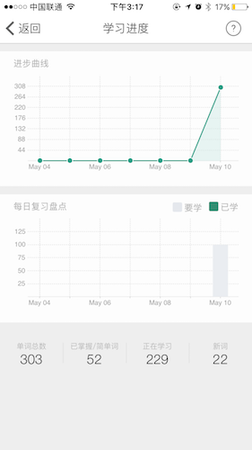
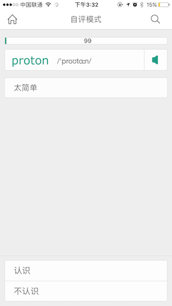
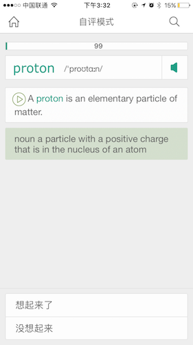
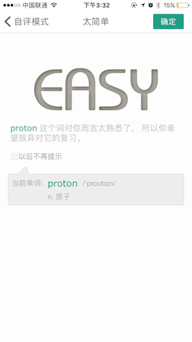
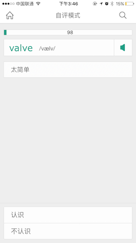
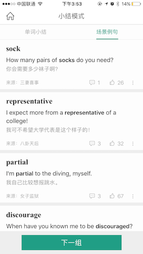
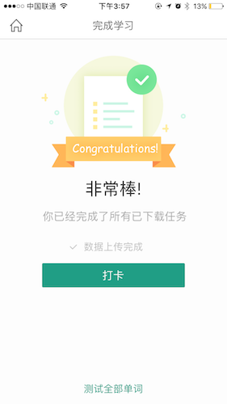

# 扇贝单词-背单词业务

## ***图1***

* 显示用户已打开天数，今日要完成的剩余单词数和历史已背单词数。
* 点击打卡天数上方的记事本样式的按钮进入打卡日历页面**图2**。
* 点击我的单词旁边的>样式的按钮进入学习进度页面**图3**。
* 点击开始学习按钮进入背单词界面**图4**。

## ***图2***

* 绿色圈表示当天有完成背单词任务，白色圈表示没有完成。
* 点击左上角“返回”回到**图1**。

## ***图3***

* 以图表形式展示用户背单词以来的进步情况和今天的任务情况。
* 底部显示用户的单词中的构成情况，由已掌握、正在学习、新词组成用户的单词库。
* 点击左上角“返回”回到**图1**。

## ***图4***

* 顶部数字代表还剩下多少个需要背的单词
* “proton”表示当前需要掌握的词
* 用户点击单词栏最右边的扩音器图标听取单词发音
* 用户点击“认识”，跳转到该单词的详情页**图5**
* 用户点击“太简单”，进入太简单页面**图6**
* 用户点击“不认识”,保留在本页面,但页面显示的内容中增加了**例句提示**，
	* 如下图

		
	
		_在图中底部出现选项“想起来了”和“没想起来”。点击“想起来了”跳转到单词的详情页**图5**，点击“没想起来”，保留在本页面，但页面显示的内容增加了**单词的英文解释**_
	* 如下图
	
		

		_在下方的两个按钮保留了下来，此时点击“想去来了”跳转到单词的详情页**图5**，点击“没想起来”，保留在本页面，但页面显示的内容增加了**单词的中文解释**_

	* 如下图

		
		
		_此时页面下方只剩下按钮“查看详细”，点击它跳转到单词的详情页**图5**。_

## ***图5***

* 用户点击单词栏最右边的扩音器图标听取单词发音
* 点击“下一个”按钮跳转到下个单词**图7**

## ***图6***

* 系统提示用户单词足够简单的话，以后的单词复习中不回出现该词。
* 用户点击左上角“<”按钮选择不放弃该单词的复习，返回到**图4**重新选择对该单词的掌握程度。
* 用户点击右上角“确认”按钮选择不再复习该词，并跳转到新单词**图7**

## ***图7***

_**通过重复以上背每个单词的过程，每完成7个为一组，当每一组要完成时，点击图5单词详情页面中的“下一个”或图6太简单页面中的“确认”时，不跳转到下一个单词的页面，跳转到单词小结页面，如图8**_

## ***图8***

_**通过重复以上背每个单词的过程，每完成7个为一组，当每一组要完成时，点击图5单词详情页面中的“下一个”或图6太简单页面中的“确认”时，不跳转到下一个单词的页面，跳转到单词小结页面，如图8**_

* 页面显示刚才背完的一组单词
* 点击场景例句显示该组中每个单词的例句，如**图9**
* 点击下一组跳到下一个新单词，如**图4**或**图7**

## ***图9***

* 页面显示刚才背完的一组单词的例句
* 点击单词小结显示该组中每个单词，如**图8**
* 点击下一组跳到下一个新单词，如**图4**或**图7**

_**重复以上背每组单词的过程，直到所有单词背完时，在小结模式中点击“下一组”将不会出现新单词，而是出现提示完成的界面，如图10**_

## ***图10***

* 提示用户完成任务
* 用户点击“打开”按钮进行打卡，显示打卡完成页面，如**图11**

## ***图11***

* 显示用户总共打卡天数和今天背的单词总数
* 分享到社交网络

