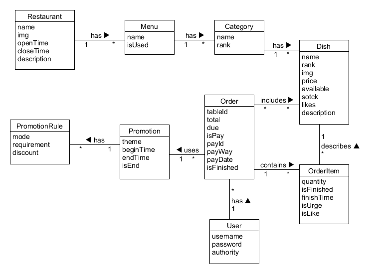

## 2. 后端

### 技术选型理由

后端架构为 Flask + MySQL；使用 Docker 部署

* Flask
  * 轻量的 Web 微框架，简洁优雅，除核心功能外都由丰富的第三方扩展提供，自由灵活；
  * 非常适合开发 web 服务的 API；
  * 文档清晰、风格统一；
  * 负责后端开发的同学更熟悉 Python 语言，上手、开发的速度更快。
* MySQL
  * 数据表间涉及到复杂的关系，因此使用关系型数据库，提高速度、灵活性。
  * MySQL 是最流行的关系型数据库，体积小、速度快、免费。

### 架构设计

由于我们使用前后端分离架构，后端只需要提供 API 服务。RESTful 风格的 API 是前后端分离的最佳实践，因此后端依靠 Flask 框架为前端提供 RESTful API 服务。后端的架构由以下几个层次组成：

* 数据访问层：对数据库进行 CRUD 操作

* 逻辑层：调用数据访问层的 CRUD 接口，执行各种业务逻辑

* 控制层：利用 Flask 框架为前端提供调用逻辑层方法的 RESTful API

  

### 模块划分

#### 数据库模型设计

根据需求，应用中需要用到的模型有`Restaurant`, `Menu`, `Category`, `Dish`, `Order`, `OrderItem`, `Promotion`, `PromotionRule`, `User`.

#### 他们的属性和关系如下图所示：



#### Restaurant

- `name`: 餐馆的名字
- `img`: 描述餐馆的图片
- `openTime`: 餐馆营业时间
- `closeTime`: 餐馆结束营业时间
- `description`: 描述餐馆的信息

在该应用中只有一个餐馆实例，因此我们使用了单例模式。餐馆可以用有多个菜单。

#### Menu

- `name`: 菜单的名字
- `isUsed`: 该菜单是否正在被使用

一个餐馆可以拥有多个菜单，但每个菜单都属于同一个餐馆。特别地，`isUsed`标识了当前使用的菜单，因此只能有一个菜单的`isUsed`字段值为`True`.菜单不直接包含菜品，而是拥有着多个类别，而类别中才包含着菜品。

#### Category

- `name`: 类别的名字
- `rank`: 类别的顺序

一个菜单可以拥有多个类别，但是一个类别只对应于一个菜单。类别中的`rank`字段仅用于前端显示时的显示顺序。一个类别可以拥有属于该类别的多个菜品。

#### Dish

- `name`: 菜品的名字
- `rank`: 菜品的顺序
- `img`: 菜品的图片
- `price`: 菜品的单价
- `available`: 菜品是否上架
- `stock`: 菜品的库存
- `likes`： 菜品的点赞数
- `description`: 菜品的文字描述

菜品的`rank`字段仅用于前端显示时的显示顺序。一个菜品只存在于一个类别之中，但一个类别可以拥有多个不同的菜品。

#### Order

- `tableId`: 下订单的桌号
- `total`: 订单的原总价
- `due`: 订单的折后应付价
- `isPay`: 订单是否被支付
- `payId`: 支付Id
- `payWay`: 支付方式
- `payDate`: 支付时间
- `isFinished`: 订单中的菜是否已全部上齐

`payId`只是用于标识订单的字段，实际情况下可能并非是一个id的形式，该字段主要用于使用第三方接口时找到实际支付的信息，用此信息与订单信息核对（主要是支付金额与`due`字段的值核对）。注意，一个订单可以包含多个菜品，而一个菜品也可以存在于多个订单中。因此，需要一个特殊的模型来描述一个订单中的每个菜的信息，在这里，我们使用了`OrderItem`模型。

#### OrderItem

- `quantity`: 单个菜品的数量
- `isFinshed`: 是否上菜
- `finishTime`: 上菜的时间
- `isUrge`: 该菜品是否被催单
- `isLike`: 该菜品是否已被点赞

注意，一个订单可以拥有多个`OrderItem`，但每个`OrderItem`只对应于一个菜品，而每个菜品可以拥有多个`OrderItem`，因为每个菜品都可以在多个订单中。`OrderItem`中所有的字段信息都用来描述某一订单下的某一菜品。

#### Promotion

- `theme`: 优惠活动的主题
- `beginTime`: 活动开始时间
- `endTime`: 活动结束时间
- `isEnd`: 活动是否已经结束

每个活动都可以有多个优惠的规则`PromotionRule`。

#### PromotionRule

- `ode`: 优惠规则的模式，分为满减和满折两种
- `requirement`: 满减或满折所要满足的前提总金额
- `discount`: 具体折扣，如果是满减，则值为满减金额，如果是满折，则值为满折的折扣

### User

- `username`: 用户名，用于登录
- `password`: 密码，用于登录
- `authority`: 权限，分为三种：`manager`, `cook`, `customer`

### API设计

为了沟通前端与后端，需要提供必需的API。

#### 用户API

- `POST cusers/session`
  用于顾客登录，我们希望使用微信登录，这样只需提供一个微信登录接口返回的id即可，实际中，我们使用一个自己输入的id代替这个微信返回的id。
  请求体：一个`username`模拟wechatid
  响应：成功返回200状态码和成功信息，失败则返回对应失败状态码和失败信息。
- `POST busers/session`
  用于商家登录，需要提供用户名和密码。密码在前端加密后传输到后端，在后端加密后保存在数据库。
  请求体：`username`和`password`
  响应：成功返回200状态码和成功信息，失败则返回对应失败状态码和失败信息。
- `PUT busers/password`
  用于修改密码。
  请求体：旧的`password`和新的`password`
  响应：成功返回200状态码和成功信息，失败则返回对应失败状态码和失败信息。

#### 菜单、类别、菜品API

- `POST menus/`
  新建菜单，只需要提供name和used字段即可。菜单中的类别通过新建类别来建立联系。在新建菜单中，无需关心类别和菜品。
  请求体：`name`和`used`
  响应：成功返回200状态码和新建菜单的id，失败则返回对应失败状态码和失败信息。
- `POST menus/<menuid>/categories/`
  在某一菜单下新建类别，只需要提供name和rank字段即可。类别中的菜品通过新建菜品来建立联系。在新建类别中，无需关心菜品。
  请求体：`name`和`rank`
  响应：成功返回200状态码和新建类别的id，失败则返回对应失败状态码和失败信息。
- `POST menus/<menuid>/categories/<catid>/dishes/`
  在某一菜单下的某一类别下新建菜品。likes点赞字段不用提供，这个字段只能由用户修改（用户点赞）。
  请求体：`name`，`rank`，`img`，`price`，`stock`，`available`
  响应：成功返回200状态码和新建菜品的id，失败则返回对应失败状态码和失败信息。
- `PUT menus/<menuid>`
- `PUT menus/<menuid>/categories/<catid>`
- `PUT menus/<menuid>/categories/<catid>/dishes/<dishid>`
  修改菜单、类别和菜品，提供的信息和`POST`时一样。
- `DELETE menus/<menuid>`
- `DELETE menus/<menuid>/categories/<catid>`
- `DELETE menus/<menuid>/categories/<catid>/dishes/<dishid>`
  删除时，并没有真正删除一个菜单、类别、菜品，因为菜品与订单有关，而订单是不能随便删除的，因此与之对应的菜品和与菜品有关的菜单和类别也不能随便删除。我们使用了假删除，只是修改其中的一个字段，用于标记是否删除。
- `GET`
  GET类型的API分为获取所有和获取单个，比如获取所有菜单是`GET menus/`，获取单个菜单则是`GET menus/<menuid>`。`GET`方法返回获取的对象的实例，用`json`格式表示。

#### 订单API

- `POST orders/cuser/`
  用户新建订单，请求体中的原价和折后价，后端需要重新计算并与之核对，若出现错误则要返回错误信息通知前端价格有错。这样做的原因是防止前端传来的请求被恶意修改。`content`对应一个数组，里面的元素是`json`，每个`json`包含了一个菜的`id`和菜的数量。
  请求体：`tableId`，`price`，`due`，`content`
  响应：成功返回200状态码和新建订单的id，失败则返回对应失败状态码和失败信息。
- `POST orders/cuser/oid/<orderId>`
  订单付款。理想情况下，我们会根据payId，使用第三方接口，查询到支付的真实信息，然后与订单的价格核对。实际情况下，我们没有申请到微信支付等第三方支付方式的接口。
  请求体：`payId`，`payWay`
  响应：成功返回200状态码和成功信息，失败则返回对应失败状态码和失败信息。
- `PUT orders/cuser/oid/<orderId>`
  用户修改订单。用户可以对他们下单的菜品进行催单和点赞，需要提供一个菜品id，是否催单的字段和是否点赞的字段。该API首先会判断该菜品id是否在这个订单中，然后判断是否已经催单或已经点赞。如果是第一次点赞，则对应的`dish`实例中的`likes`也要响应加1.
  请求体：`orderItemId`，`like`，`urge`
  响应：成功返回200状态码和成功信息，失败则返回对应失败状态码和失败信息。
- `PUT orders/buser/oid/<orderId>`
  商家修改订单。商家完成订单中的一个菜品时，传入`time`和`finished`字段表示菜品完成以及完成时间。注意当订单中，所有的菜品都已经完成，那么订单的`finished`字段会自动设置为`True`。
  请求体：`orderItemId`，`time`，`finished`
  响应：成功返回200状态码和成功信息，失败则返回对应失败状态码和失败信息。
- `GET`
  `GET`请求可以返回单个或全部订单，分为商家可以看到的订单或用户可以看到的订单。比如商家获取全部订单`GET orders/buser/`, 用户获取单个订单`GET orders/cuser/oid/<orderId>

### 组织结构

根据架构与设计的 API，我们的文件组织结构为：

```bash
.
├── Dockerfile
├── LICENSE
├── README.md
├── app
│   ├── __init__.py
│   ├── api 逻辑层，每一个文件中实现对应 api 中的操作
│   │   └── v1
│   │       ├── __init__.py
│   │       ├── analytics.py
│   │       ├── buser.py
│   │       ├── cuser.py
│   │       ├── menu.py
│   │       ├── order.py
│   │       ├── photo.py
│   │       ├── promotion.py
│   │       ├── restrt.py
│   │       ├── rule.py
│   │       └── utils.py
│   ├── config.py  配置模块，存有各项默认配置
│   ├── gen_data.py
│   ├── login.py  登录、权限验证模块
│   └── models.py  数据访问层，主要有 Flask SQLAlchemy 提供
├── docker-entrypoint.sh
├── manage.py  控制层，主要由 Flask 提供
├── requirements.txt
├── static
│   └── images
│       ├── dishes
│       │   └── default.png
│       └── restrts
│           └── default.png
└── tests 单元测试模块
    ├── test_analytics.py
    ├── test_buser.py
    ├── test_category.py
    ├── test_cuser.py
    ├── test_data.py
    ├── test_dish.py
    ├── test_menu.py
    ├── test_order.py
    ├── test_promotion.py
    ├── test_restrt.py
    └── test_rule.py
```

### 软件设计技术

#### The Resource-Oriented Architecture

面向资源的架构设计，主要体现在我们使用 RESTful 的 API 设计。 所有的事物都被抽象为资源，对这些资源定义无状态的增删查改操作。详细的 API 设计可见 [7.3 API Design](https://orderease.github.io/Dashboard/Design/API-Swagger-Preview/index.html), 这些 API 的实现都在 `app/api/v1` 中。


#### Objected-Oriented Programming

把数据库的每一张表的属性和方法封装成为一个类作为数据访问层，借助 Flask SQLAlchemy 实现 CRUD 的操作，给逻辑层提供 CRUD 的接口，这样实现逻辑时就不需要关注数据库操作的细节：

```python
db = SQLAlchemy()

class User(db.Model, UserMixin):  # 继承 db.Model 中操作数据库 CRUD 的类方法

    __tablename__ = 'users'
	
    # 定义表中的属性
    id = db.Column(db.Integer, primary_key=True)
    username = db.Column(db.String(32), doc='用户名', unique=True)
    password = db.Column(db.String(100), doc='密码', nullable=True)
    authority = db.Column(db.String(32), doc='权限, [customer, manager, cook]', nullable=False)
    register_date = db.Column(db.DateTime, nullable=True)
```

#### Decorator

把登录与权限验证功能写成一个装饰器，从而能很方便地为函数添加权限验证功能。并且通过一个装饰器生成函数，根据传进的 `authority` 参数生成限制对应权限的装饰器

装饰器函数定义：

```python
def login_required(authority="ANY"):
    """Custom login required decorator.
    If the method contains {userID_filed_name} args, the decorator would check whether
    the userId is the same as current user's.
    Args:
        authority (str, optional): {ANY, customer, manager, cook} The required role of the user
    Returns:
        function: The desired decorator wrapper.
    """
    def wrapper(func):
        @wraps(func)
        def decorated_view(*args, **kwargs):
            if not current_user.is_authenticated:
                # print(current_user.authority)
                return current_app.login_manager.unauthorized()
            if authority != "customer":
                if authority == 'cook' and current_user.authority == 'customer':
                    return {'message': 'Your authority is not valid.'}, 401
                if authority == 'manager' and current_user.authority != 'manager':
                    return {'message': 'Your authority is not valid.'}, 401

            return func(*args, **kwargs)
        return decorated_view
    return wrapper
```

装饰器使用：

```python
# Menu
@api.route('/')
class Menus(Resource):

    # 新建菜单
    @login_required(authority='manager')
    def post(self):
		pass

    # 获取所有菜单
    @login_required(authority='cook')
    def get(self):
		pass
```

