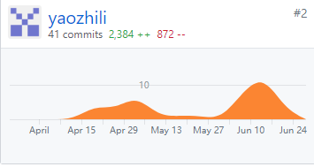
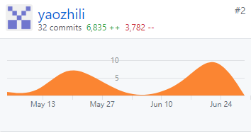

# Final Report

## 自我总结
在这个项目中，我主要负责API的设计和`menu`、`category`、`dish`、`order`、`restaurant`的API实现和测试。感谢我的队友们协助我发现并修改许多bug，也指出API设计中许多不合理的地方，让我明白很多时候一开始凭空想出来的API到了最后都要重新设计。数据模型的设计也尤为重要，感觉上在实践中，通过不断迭代，才能得到一个比较好的数据模型，因为在实践过后才更容易考虑他们的属性和模型间的关系。

## PSP2.1统计表
PSP表项 | 工作量
- | :-: 
**计划** | 5
**开发** | 
分析需求 | 5
生成设计文档 | 
设计复审 | 5
代码规范 | 5
具体设计 | 20
具体编码 | 30
代码复审 | 10
测试 | 25

## 个人分支的 GIT 统计报告
API设计

API实现与测试

## 自认为最得意/或有价值/或有苦劳的工作清单
* restfulAPI设计，通过自学和在队友的帮助下设计API是一件很好玩的事情。
* API的实现，重点在于数据模型的设计，以及处理数据库对象的关系。
* API的测试，初次感受到对于一个项目而言的软件单元测试过程，如何设计测试用例是关键。
