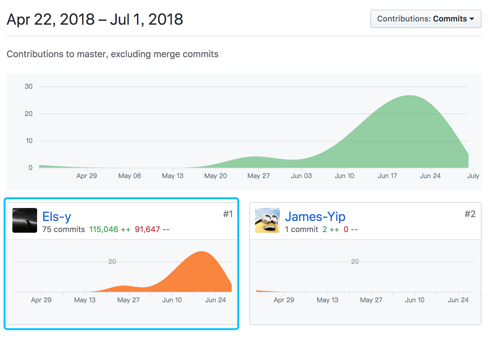
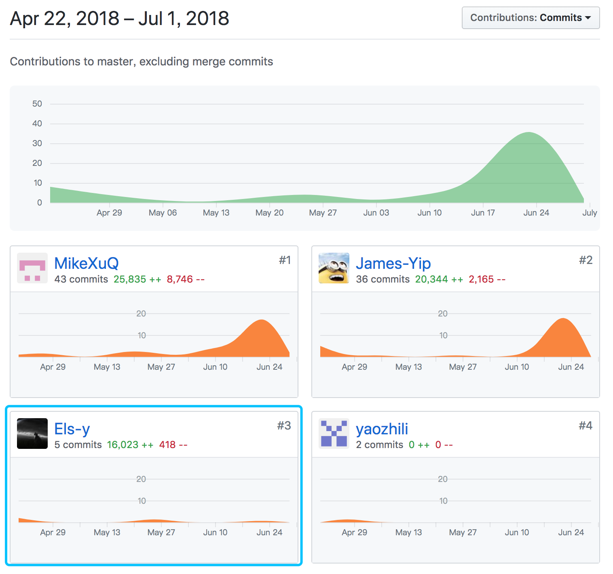
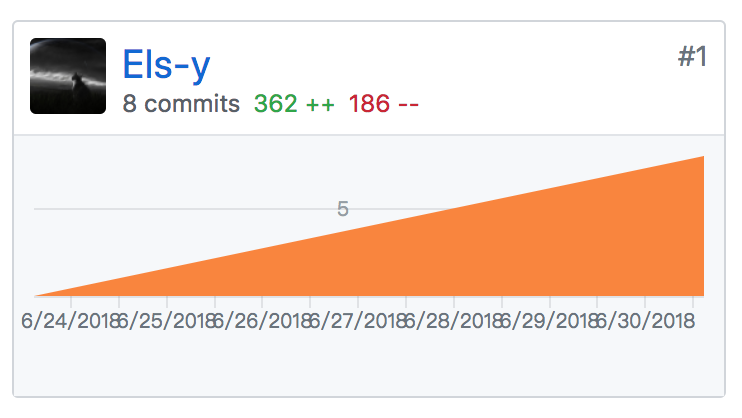

# Final Report

## 个人总结

这次大作业中，我主要负责商家端界面的设计与实现，这是我第一次做一个比较完整的项目，从用例图、领域模型等的设计绘制，到后来需求文档的规范，以及代码的编写、测试、部署等。老实说，刚开始对各种图的绘制不以为然，直到后来实际开发的时候才发现这些图的重要性，可以帮助我们理解整个软件架构的设计，让我们有一个统一清晰的理解，降低理解分歧的概率。

在这次项目中，我学到了很多以前没有接触或深入的东西，包括 ES6、Vue、Webpack、Nginx、Docker 等等，在使用过程中也遇到了很多问题，踩了各种坑。不过，通过查阅资料，一步步解决这些问题的过程促进了我的进步，加深了对技术的理解。第一次正经做前端，感受到了前端是一个很庞大的圈子，涵盖了很多方面的东西，各种框架、工具出现的意义以及最佳实践都值得去品味。另外，这次项目采用前后端分离模式，让我体会到这种模式的开发过程真的很舒服，不像 MVC 模式中视图依赖于模型以及渲染视图的过程在服务端完成，在这里要赞扬一下提出这种模式的人可以说是很伟大了。

最后，感谢所有队友的共同努力。

## PSP 2.1 统计

| PSP2.1 | Personal Software Process Stages | Time（%） |
| ------------ | ------------- | ------------- |
| **Planing**  | **计划**  | **6** |
| - Estimate |  估计开发时间  | 6 |
| **Development** |  **开发**  | **90** |
| - Analysis |  需求分析  | 10 |
| - Design Spec |  生成设计文档  | 6 |
| - Design Review |  设计复审  | 4 |
| - Coding Standard |  代码规范  | 2 |
| - Design |  具体设计  | 8 |
| - Coding |  具体编码  | 30 |
| - Code Review |  代码复查  | 10 |
| - Test |  测试  | 20 |
| **Reporting** |  **报告**  | **4** |
| - Test Report |  测试报告  | 2 |
| - Postmortem |  事后总结  | 2 |

## GIT 统计报告

### Orderease-2B

### Orderease-2C

### Deployment

## 工作清单

* 前端设计与实现
* Docker 部署 MySQL + Flask + Nginx
* Travis CI 自动测试、部署

## 技术博客清单

* [Docker 安装并运行 Express 应用](http://www.elsye.cn/docker/docker-install-express/)

